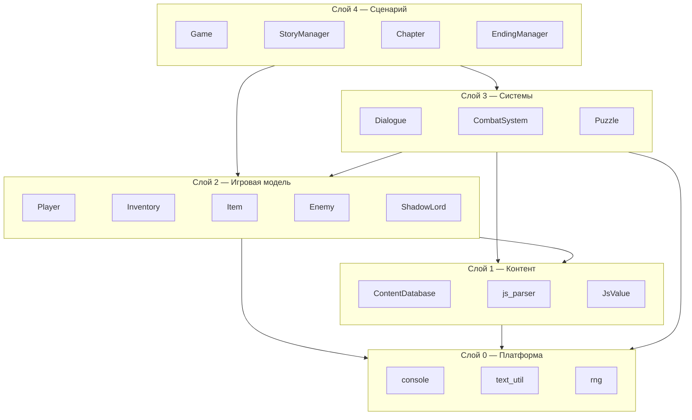
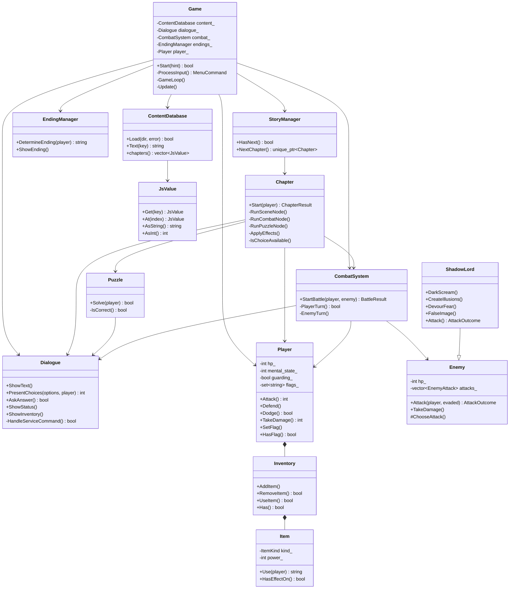
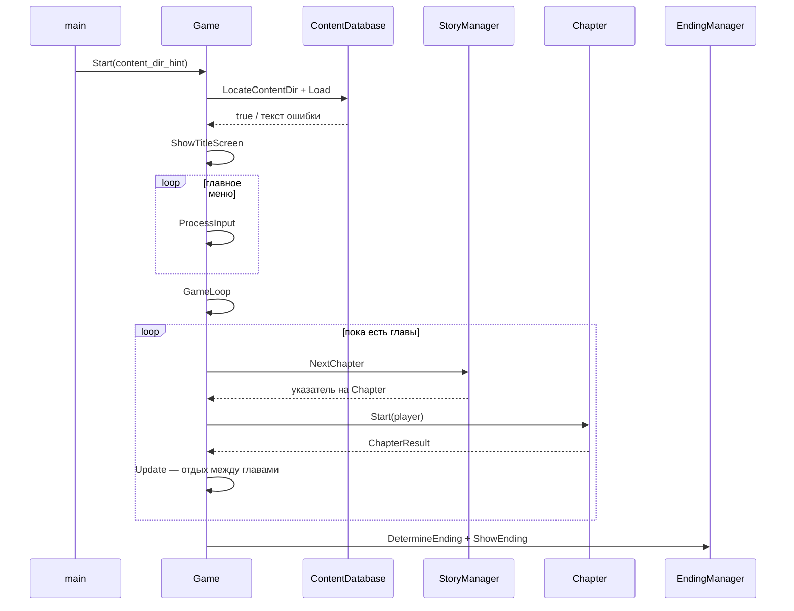

# Архитектура Tenebris

Как устроен код, что где лежит и почему именно так. Документ описывает
проект целиком: от `main()` до формата `.js`-файлов с контентом.

Быстрый старт и сборка — в [README.md](README.md).

## Содержание

1. [Ключевая идея](#1-ключевая-идея)
2. [Карта репозитория](#2-карта-репозитория)
3. [Слои и зависимости](#3-слои-и-зависимости)
4. [Диаграмма классов](#4-диаграмма-классов)
5. [Жизненный цикл запуска](#5-жизненный-цикл-запуска)
6. [Сквозной трейс: игрок ввёл «1»](#6-сквозной-трейс-игрок-ввёл-1)
7. [Разбор классов по слоям](#7-разбор-классов-по-слоям)
8. [Формат контента](#8-формат-контента)
9. [Правила проекта](#9-правила-проекта)
10. [Как расширять](#10-как-расширять)
11. [Сборка и проверки](#11-сборка-и-проверки)
12. [Известные ограничения](#12-известные-ограничения)

---

## 1. Ключевая идея

Проект разделён на **движок** и **контент**.

* **Движок** (`src/`, C++) не знает ни одной строки игрового текста. Он умеет
  читать данные, показывать текст, спрашивать игрока, считать урон и
  переходить между узлами сюжета.
* **Контент** (`content/`, JavaScript) содержит вообще всё, что игрок видит:
  главы, диалоги, загадки, врагов, предметы, концовки и даже подписи пунктов
  меню и синонимы команд.

Практическое следствие: чтобы переписать диалог, добавить главу, поменять
баланс врага или перевести игру на другой язык — **пересобирать проект не
нужно**. Меняются только `.js`-файлы.

Второе следствие: движок обязан корректно переживать кривой контент. Поэтому
у загрузчика есть внятные ошибки с номером строки, а у большинства полей —
значения по умолчанию.

---

## 2. Карта репозитория

```
Tenebris/
├── Tenebris.sln                 решение Visual Studio 2026
├── Tenebris.vcxproj             проект: файлы, флаги, копирование контента
├── Tenebris.vcxproj.filters     раскладка по папкам в обозревателе решений
├── .clang-format                Google style для clang-format
├── CPPLINT.cfg                  настройки cpplint (корень, длина строки)
├── .gitignore
├── README.md                    как собрать и запустить
├── ARCHITECTURE.md              этот документ
│
├── src/                         движок
│   ├── main.cc                  точка входа, разбор аргументов
│   │
│   ├── game.h/.cc               Game — главное меню и цикл глав
│   ├── game_context.h           GameContext — пучок ссылок на системы
│   ├── story_manager.h/.cc      StoryManager — выдаёт главы по порядку
│   ├── chapter.h/.cc            Chapter — исполняет граф узлов главы
│   ├── ending_manager.h/.cc     EndingManager — выбор и показ концовки
│   │
│   ├── dialogue.h/.cc           Dialogue — вывод текста, меню, команды
│   ├── puzzle.h/.cc             Puzzle — загадки
│   ├── combat_system.h/.cc      CombatSystem — пошаговый бой
│   │
│   ├── player.h/.cc             Player — HP, психика, флаги, инвентарь
│   ├── inventory.h/.cc          Inventory — список вещей
│   ├── item.h/.cc               Item — вещь и её эффект
│   ├── enemy.h/.cc              Enemy — теневое существо
│   ├── shadow_lord.h/.cc        ShadowLord : Enemy — босс
│   ├── enemy_factory.h/.cc      CreateEnemy — выбор нужного класса врага
│   │
│   ├── content_database.h/.cc   ContentDatabase — загрузка всех данных
│   ├── js_parser.h/.cc          парсер .js-файлов
│   ├── js_value.h/.cc           JsValue — дерево разобранных данных
│   │
│   ├── console.h/.cc            UTF-8, перенос строк, ввод, шкалы
│   ├── text_util.h/.cc          строковые утилиты для UTF-8
│   └── rng.h/.cc                генератор случайных чисел
│
└── content/                     контент
    ├── index.js                 манифест: какие файлы грузить
    ├── ui.js                    ВСЕ строки интерфейса и синонимы команд
    ├── items.js                 предметы
    ├── enemies.js               враги и их атаки
    ├── puzzles.js               загадки
    ├── endings.js               три концовки
    └── chapters/
        ├── chapter_1.js         Глава 1. Пропавший друг
        ├── chapter_2.js         Глава 2. Портал в мир теней
        ├── chapter_3.js         Глава 3. Память прошлого
        ├── chapter_4.js         Глава 4. Лес Иллюзий
        ├── chapter_5.js         Глава 5. Башня Теней
        ├── chapter_6.js         Глава 6. Испытание решимости
        └── chapter_7.js         Глава 7. Финальная битва
```

Имена файлов — по Google style: `lower_snake_case`, реализация в `.cc`,
объявления в `.h`. Один файл — один класс (кроме мелких помощников вроде
`EnemyAttack`, которые живут рядом с тем, кому нужны).

---

## 3. Слои и зависимости

Код разложен на пять слоёв. Зависимости идут **только сверху вниз**:
слой ниже никогда не знает о слое выше.



Что даёт такое разделение:

| Слой | Отвечает за | Не знает про |
|---|---|---|
| 0. Платформа | консоль, UTF-8, случайность | игру вообще |
| 1. Контент | чтение `.js`, доступ к данным | правила игры |
| 2. Модель | цифры: HP, психика, урон, вещи | как это показать игроку |
| 3. Системы | взаимодействие с игроком | порядок глав и сюжет |
| 4. Сценарий | что за чем происходит | как считается урон |

Например, `Player` умеет получить урон, но не умеет ничего напечатать —
печатает `CombatSystem` через `Dialogue`. А `Dialogue` умеет напечатать что
угодно, но не знает, идёт бой или разговор.

---

## 4. Диаграмма классов



### Соответствие UML из ГДД

Диаграмма из проектной документации реализована один в один:

| Класс на UML | Файл | Методы с UML | Что добавилось |
|---|---|---|---|
| `Game` | `game.h` | `start`, `gameLoop`, `processInput`, `update` | — |
| `Chapter` | `chapter.h` | `start` | разбор узлов по типам |
| `Dialogue` | `dialogue.h` | `showText`, `presentChoices` | служебные команды игрока |
| `Puzzle` | `puzzle.h` | `solve` | подсказки, попытки, награда |
| `EndingManager` | `ending_manager.h` | `determineEnding` | `ShowEnding` |
| `CombatSystem` | `combat_system.h` | `startBattle`, `playerTurn`, `enemyTurn` | приёмы финальной битвы |
| `StoryManager` | `story_manager.h` | `nextChapter` | — |
| `Player` | `player.h` | `hp`, `mentalState`, `attack`, `defend`, `dodge` | флаги решений |
| `Enemy` | `enemy.h` | `hp`, `attack` | таблица атак с весами |
| `ShadowLord` | `shadow_lord.h` | `darkScream`, `createIllusions` | `DevourFear`, `FalseImage` |
| `Inventory` | `inventory.h` | `addItem`, `useItem` | `RemoveItem`, `Has`, `Find` |
| `Item` | `item.h` | `use` | виды предметов, `HasEffectOn` |

Служебные классы, которых на UML нет, потому что это инфраструктура, а не
игровые сущности: `ContentDatabase`, `JsValue`, `js_parser`, `console`,
`text_util`, `rng`, `GameContext`, `CreateEnemy`.

---

## 5. Жизненный цикл запуска



Пошагово:

1. **`main()`** (`main.cc`) включает UTF-8 в консоли, читает необязательные
   аргументы `[путь_к_content] [seed]` и создаёт `Game`.
2. **`Game::Start()`** ищет папку с контентом (`LocateContentDir`), грузит его
   (`ContentDatabase::Load`). Если не вышло — печатает причину и возвращает
   `false`, `main` отдаёт код возврата 1.
3. Показывает заставку и крутит меню: **`Game::ProcessInput()`**.
4. «Новая игра» → **`Game::GameLoop()`**: сбрасывает `player_`, собирает
   `GameContext` и просит главы у `StoryManager`.
5. После каждой главы — **`Game::Update()`**: проверяет, жива ли героиня,
   восстанавливает 25 HP и 10 психики, показывает статус и ждёт Enter.
6. Когда главы кончились или глава вернула концовку — **`EndingManager`**
   выбирает и печатает финал.

Три способа завершить прогон:

| Что произошло | Что вернула глава | Что дальше |
|---|---|---|
| Глава пройдена | `kCompleted` | следующая глава |
| Узел или выбор задал концовку | `kEnding` + `ending_id` | сразу финал |
| Игрок ввёл «выход» | `kQuit` | выход без финала |

---

## 6. Сквозной трейс: игрок ввёл «1»

Самый полезный раздел, если нужно понять, «как оно вообще крутится».
Ситуация: идёт глава 1, игрок видит меню и вводит `1`.

```
Chapter::Start()                       цикл по узлам главы
 └─ FindNode("house_hall")             ищет узел по id в chapter_1.js
 └─ Dialogue::ShowText(node.text)      печатает описание комнаты
     └─ console::Print()
         └─ text_util::Wrap()          перенос по словам, 72 символа
 └─ Chapter::ApplyEffects(on_enter)    выдаёт предметы, меняет HP/психику
 └─ RunSceneNode(node)
     ├─ для каждого choice:
     │   IsChoiceAvailable()           require_items / require_flags /
     │                                 forbid_flags / require_mental
     │   → доступен: обычный пункт
     │   → нет и hidden: пункт скрыт
     │   → нет и не hidden: пункт «[недоступно]» + locked_text
     ├─ Dialogue::PresentChoices(options, player)
     │   ├─ печатает пункты шаблоном ui.choice_line
     │   ├─ console::ReadLine()        ждёт ввод
     │   ├─ это число в диапазоне?     → возвращает индекс
     │   ├─ это служебная команда?     → HandleServiceCommand и спросить снова
     │   └─ иначе                      → ui.unknown_command и спросить снова
     ├─ ApplyEffects(choice.effects)   Player::ChangeHp / GrantItem / SetFlag
     └─ return choice.next             id следующего узла
 └─ проверка: жива ли героиня, не сломана ли психика
 └─ ++moves_spent_ и проверка лимита ходов (глава 6)
 └─ current = next → следующая итерация
```

Если узел оказался боем (`type: "combat"`):

```
RunCombatNode()
 └─ CreateEnemy(content, node.enemy)   Enemy или ShadowLord — по полю boss
 └─ CombatSystem::StartBattle(player, enemy.get())
     └─ пока оба живы:
         ├─ ShowGauges()               три шкалы: HP, психика, HP врага
         ├─ PlayerTurn()
         │   ├─ собирает меню приёмов  обычное или из финальной битвы
         │   ├─ Dialogue::PresentChoices()
         │   └─ применяет приём        Player::Attack / Defend / Dodge / ...
         ├─ враг мёртв? → kVictory, флаг "defeated_<id>"
         ├─ EnemyTurn()
         │   ├─ щит поглотил удар? → выход
         │   ├─ evaded = dodging_ && Player::Dodge()
         │   ├─ Enemy::Attack(player, evaded) → AttackOutcome
         │   └─ печатает урон, блокировки, лечение врага
         └─ HP == 0 или психика == 0 → kDefeat
 └─ победа → node.on_win, поражение → node.on_lose или node.lose_ending
```

Если узел — загадка (`type: "puzzle"`):

```
RunPuzzleNode()
 └─ FindById(content.puzzles(), node.puzzle)
 └─ Puzzle::Solve(player)
     ├─ Dialogue::ShowText(puzzle.text)
     └─ до attempts раз:
         ├─ Dialogue::AskAnswer()      служебные команды работают и здесь
         ├─ IsCorrect()                text_util::Normalize с обеих сторон
         ├─ верно → mental_reward, reward_item, set_flag → true
         └─ неверно → mental_penalty, подсказка
     └─ попытки кончились → fail_text, hp_penalty, fail_flag → false
 └─ true → node.on_solve, false → node.on_fail
```

---

## 7. Разбор классов по слоям

### 7.1. Слой 0 — Платформа

#### `console` (`console.h/.cc`)

Единственное место, где код общается с терминалом. Всё остальное печатает
только через него.

| Функция | Что делает |
|---|---|
| `Initialize()` | `SetConsoleOutputCP(CP_UTF8)` и `SetConsoleCP(CP_UTF8)` под Windows, иначе пусто. Вызывается один раз из `main` |
| `Print(text)` | печать с переносом по словам на `kLineWidth` = 72 символа |
| `PrintRaw(text)` | печать как есть — для ASCII-заставки и заголовков |
| `PrintRule()` | горизонтальная линия между сценами |
| `PrintGauge(label, value, max)` | шкала вида `Здоровье [########....] 80/100`, 20 ячеек |
| `ReadLine(line)` | читает строку; `false` означает конец потока ввода, игра выходит |
| `WaitForEnter(prompt)` | пауза между главами |
| `Clear()` | `cls` под Windows, ANSI-escape в остальных случаях |

Платформенный код спрятан за `#ifdef _WIN32` — на Linux/macOS всё собирается
и работает, что и позволяет гонять автотесты вне Windows.

#### `text_util` (`text_util.h/.cc`)

Строковые утилиты, все — с учётом того, что текст в UTF-8 и русский.

| Функция | Зачем нужна |
|---|---|
| `Trim` | обрезка пробелов вокруг ввода игрока |
| `Normalize` | приведение к нижнему регистру для латиницы **и** кириллицы, «ё» → «е». Используется при сравнении ответов на загадки и команд |
| `GlyphCount` | длина в символах, а не в байтах: русская буква занимает 2 байта, и без этого перенос строк съезжал бы |
| `Wrap` | перенос по словам. Сохраняет отступ в начале строки, поэтому пункты меню `  1. ...` не «схлопываются» влево |
| `ReplaceAll` | подстановка |
| `Format` | подставляет `{0}`, `{1}` в шаблоны из `ui.js` |
| `FromInt` | число в строку без потоков |

`Normalize` — самая неочевидная функция. Кириллические заглавные буквы лежат
в UTF-8 как `0xD0 0x90…0xD0 0xAF`, а строчные начинаются с `0xD0 0xB0` и
после «п» переходят на ведущий байт `0xD1`. Именно этот переход через границу
и обрабатывается отдельно — комментарий об этом есть прямо в коде.

#### `rng` (`rng.h/.cc`)

Единственный генератор случайных чисел на всю игру.

* `Seed(seed)` — фиксирует последовательность. Вызывается из `main`, если
  передан второй аргумент командной строки. Нужно для воспроизводимых
  тестов боя.
* `Range(low, high)` — равномерно, включая границы.
* `Chance(percent)` — «выпало с вероятностью N %».

Движок `std::mt19937` живёт в функции-обёртке `Engine()` как локальная
статическая переменная — так Google style разрешает статические объекты
с нетривиальным конструктором.

### 7.2. Слой 1 — Контент

#### `JsValue` (`js_value.h/.cc`)

Динамическое дерево, в которое разбираются `.js`-файлы. Аналог `JSON::Value`,
только маленький и без зависимостей.

* Типы: `kNull`, `kBool`, `kNumber`, `kString`, `kArray`, `kObject`.
* Поля объекта хранятся в `std::vector<std::pair<string, JsValue>>`, а не в
  `std::map` — **порядок объявления сохраняется**, поэтому файлы контента
  читаются в том же порядке, в котором написаны.
* Доступ безопасный: `Get("нет_такого_ключа")` возвращает ссылку на общий
  пустой `JsValue::Null()`, а не падает. Поэтому цепочки вида
  `def.Get("special").Get("dark_scream").Get("hp_damage").AsInt(0)` не требуют
  проверок на каждом шаге.
* `AsInt(fallback)`, `AsString(fallback)` и остальные геттеры всегда принимают
  значение по умолчанию — это и есть механизм необязательных полей контента.
* `AsStringList()` принимает и массив строк, и одну строку. Благодаря этому
  в контенте можно писать `text: "одна строка"` вместо `text: ["одна строка"]`.
* Свободная функция `FindById(array, id)` ищет элемент массива с нужным
  полем `id` — так находятся враги, загадки, предметы и концовки.

#### `js_parser` (`js_parser.h/.cc`)

Рекурсивный спуск по подмножеству JavaScript. Никакого JS-движка нет и код не
исполняется — читаются только данные.

Что понимает:

* присваивание вида `Tenebris.content.chapter_1 = <литерал>;`
* комментарии `//` и `/* */`
* ключи объекта без кавычек: `id: "village"`
* строки в одинарных и двойных кавычках
* висячие запятые: `[1, 2, 3,]`
* склейку строк плюсом: `"начало " + "продолжение"`
* escape-последовательности, включая `\uXXXX` и суррогатные пары

Ошибки возвращаются как `false` + текст вида
`content/ui.js:42:17: expected ',' or '}'` — с именем файла, строкой и
колонкой. Исключения не используются: класс `Parser` копит сообщение в
`error_` и возвращает `false` вверх по стеку. Глубина вложенности ограничена
константой `kMaxDepth` = 64.

#### `ContentDatabase` (`content_database.h/.cc`)

Фасад над всем контентом.

* `Load(dir, error)` читает `index.js`, затем каждый файл из манифеста.
  Возвращает `false` и заполняет `*error` при первой же проблеме.
* Геттеры `ui()`, `items()`, `enemies()`, `puzzles()`, `endings()`,
  `chapters()` отдают уже разобранные `JsValue`.
* `Text(key)` — строка интерфейса. Если ключа нет, возвращается **сам ключ**:
  на экране видно `combat_victory` вместо пустоты, и опечатка сразу заметна.
* `Text(key, args)` — то же с подстановкой `{0}`, `{1}`.
* `TextList(key)` — многострочные записи вроде справки.

Свободная функция `LocateContentDir(hint, out)` ищет папку с контентом:
сначала подсказку из аргументов командной строки, затем `content`,
`../content`, `../../content` и так далее на четыре уровня вверх. Из-за этого
игра одинаково запускается из папки проекта (F5 в Visual Studio) и из папки
сборки рядом с `.exe`.

### 7.3. Слой 2 — Игровая модель

#### `Player` (`player.h/.cc`)

Состояние героини. Ничего не печатает.

Константы (все из ГДД):

| Константа | Значение | Смысл |
|---|---|---|
| `kMaxHp` | 100 | стартовое и максимальное здоровье |
| `kMaxMental` | 100 | психологическая шкала |
| `kFragileMental` | 30 | ниже этого героиня «хрупкая» |
| `kMinAttackDamage` / `kMaxAttackDamage` | 10 / 20 | разброс базовой атаки |
| `kDodgeChancePercent` | 50 | шанс уклонения |
| `kGuardReductionPercent` | 50 | насколько защита режет урон |

Методы:

* `Attack()` — бросок 10–20. Если героиня хрупкая, урон уменьшается на
  четверть: страх бьёт и по её собственной атаке.
* `Defend()` — поднимает флаг `guarding_`, который сработает один раз.
* `Dodge()` — бросок на уклонение; у хрупкой шанс падает с 50 % до 35 %.
* `TakeDamage(hp_damage, mental_damage)` — вся арифметика урона в одном
  месте: сначала защита режет вдвое и гаснет, затем хрупкость добавляет
  50 %. Возвращает, сколько HP реально потеряно, чтобы бой мог это напечатать.
* `SetFlag` / `HasFlag` — множество строк-меток. Это **память о решениях
  игрока**: `trusted_guide`, `friend_freed`, `bridge_failed`, `mind_broken`
  и так далее. На флагах держатся условия выбора и выбор концовки.

`broken()` (психика на нуле) — отдельное поражение, не равное смерти.

#### `Inventory` (`inventory.h/.cc`) и `Item` (`item.h/.cc`)

`Inventory` — вектор предметов с поиском по `id`. Дубликаты разрешены: два
яблока — это две записи, `RemoveItem` убирает одну.

`Item` строится из данных: `Item::FromJs(def)`. Виды (`ItemKind`):

| Вид | Поведение |
|---|---|
| `kHeal` | восстанавливает HP, расходуется |
| `kMental` | восстанавливает психику, расходуется |
| `kKey` | открывает проход, не расходуется |
| `kQuest` | сюжетный, не расходуется |

* `usable()` — можно ли применить вручную (только лечебные виды).
* `HasEffectOn(player)` — «а будет ли толк прямо сейчас». Не даёт съесть
  яблоко при полном здоровье и потерять его впустую.
* `Use(player)` — применяет эффект и возвращает **готовую строку** для
  печати, взяв шаблон `use_text` из контента.

Свободная функция `GrantItem(content, item_id, player)` находит предмет по
`id` и кладёт его в инвентарь — ей пользуются главы и загадки.

#### `Enemy` (`enemy.h/.cc`)

Теневое существо, целиком собранное из `enemies.js`.

* `EnemyAttack` — одна строка таблицы атак: имя, текст, урон по HP, урон по
  психике, `blocked_turns` (блокировка способностей) и `weight` — вес при
  случайном выборе.
* `AttackOutcome` — результат хода врага: что напечатать, сколько HP и
  психики потеряно, сколько ходов заблокировано, сколько врагу вылечили,
  было ли уклонение. Возвращается наверх, чтобы **печатал не враг, а бой** —
  враг не знает про консоль.
* `ChooseAttack()` — взвешенный случайный выбор из таблицы.
* `Attack(player, evaded)` — виртуальный. Если `evaded`, приём объявляется,
  но эффекта не наносит.

#### `ShadowLord` (`shadow_lord.h/.cc`)

Наследник `Enemy` — Повелитель Теней. Четыре именованных приёма из ГДД,
каждый публичный метод:

| Метод | Что делает |
|---|---|
| `DarkScream` | 15 урона + удар по психике |
| `CreateIllusions` | блокирует способности героини на ход |
| `DevourFear` | лечит себя, пока героиня слаба |
| `FalseImage` | принимает облик Элиана, бьёт только по психике |

Переопределённый `Attack()` — это и есть ИИ босса:

```
если HP героини < 50 и босс ранен, с шансом 45 % → DevourFear
с шансом 25 %                                   → CreateIllusions
если психика > 30, с шансом 30 %                → DarkScream
с шансом 30 %                                   → FalseImage
иначе                                           → обычная атака из таблицы
```

Условие «психика > 30» — намеренная поблажка: когда героиня уже на грани,
босс перестаёт добивать её самым тяжёлым приёмом.

#### `CreateEnemy` (`enemy_factory.h/.cc`)

Одна свободная функция. Находит определение врага по `id` и создаёт
`ShadowLord`, если в данных стоит `boss: true`, иначе обычного `Enemy`.
Возвращает `std::unique_ptr<Enemy>` или `nullptr`, если `id` неизвестен.
Благодаря ей нигде в коде нет `dynamic_cast` и проверок типа.

### 7.4. Слой 3 — Системы

#### `Dialogue` (`dialogue.h/.cc`)

Всё общение с игроком. Единственный класс, который читает ввод.

Вывод: `ShowText`, `ShowLine`, `ShowTitle`, `ShowUi(key)`, `ShowStatus`,
`ShowInventory`, `ShowHelp`.

Ввод:

* **`PresentChoices(options, player)`** — печатает пронумерованные пункты и
  ждёт корректный выбор. Возвращает индекс пункта или `kQuitRequested` (−1).
  Внутри цикл: число в диапазоне — успех; недоступный пункт — печатает
  `locked_text` и спрашивает снова; служебная команда — выполняет и
  спрашивает снова; мусор — сообщение об ошибке и снова.
* **`AskAnswer(prompt, player, answer)`** — свободный ответ для загадок.
  Служебные команды работают и здесь.
* **`UseItemInteractive(player)`** — показать инвентарь и применить вещь.
  Возвращает `true`, только если вещь реально применена: в бою от этого
  зависит, потрачен ход или нет.

**Служебные команды** обрабатывает `HandleServiceCommand`. Она разбивает ввод
на первое слово и остаток, нормализует слово и сверяет со списками синонимов
из `ui.commands`. Списки лежат в контенте, поэтому добавить синоним или
перевести команды можно без правки C++:

```js
commands: {
  help:      ["помощь", "справка", "help", "?"],
  status:    ["статус", "состояние", "status"],
  inventory: ["инвентарь", "вещи", "inventory", "inv"],
  use:       ["использовать", "применить", "use"],
  quit:      ["выход", "выйти", "quit", "exit"]
}
```

`ChoiceOption` — структура пункта меню: текст, доступен ли, что сказать при
попытке выбрать недоступный.

#### `CombatSystem` (`combat_system.h/.cc`)

Пошаговый бой. Ход игрока, затем ход врага, пока кто-то не кончится.

Состояние раунда сбрасывается в начале каждого боя:

| Поле | Смысл |
|---|---|
| `sealed_turns_` | сколько ходов способности заблокированы иллюзиями |
| `dodging_` | героиня потратила ход на уклонение |
| `hidden_ready_` | был пропуск хода → доступна Скрытая атака |
| `shielded_` | Щит света поглотит следующий удар целиком |

`PlayerTurn()` собирает меню, **разное для босса и обычного врага**:

Обычный бой — из ГДД: Атака (10–20), Защита (−50 % урона), Уклонение (50 %),
Сила теней (`kShadowPowerHeal` = 15 HP либо `kShadowPowerDamage` = 12 урона,
цена `kShadowPowerMentalCost` = 5 психики), Использовать вещь.

Финальная битва — отдельный набор приёмов из ГДД:

| Приём | Эффект | Константа |
|---|---|---|
| Пропуск хода | +5 HP, открывает Скрытую атаку | `kSkipTurnHeal` |
| Удар Тени | 10 урона | `kShadowStrikeDamage` |
| Сила воли | +15 психики, −5 HP | `kWillpowerMentalGain` / `kWillpowerHpCost` |
| Щит света | блокирует один удар, +10 HP | `kLightShieldHeal` |
| Скрытая атака | 20 урона, только после пропуска хода | `kHiddenAttackDamage` |

Две тонкости, которые легко упустить при чтении:

* Ход считается потраченным не всегда. Если игрок выбрал «Использовать вещь»,
  но применять нечего, `turn_spent` остаётся `false` и меню показывается
  снова — ход не сгорает.
* `hidden_ready_` сбрасывается после **любого** приёма, кроме пропуска хода.
  То есть Скрытая атака действительно требует подготовки.

`EnemyTurn()` разрешает уклонение (`dodging_ && player->Dodge()`), вызывает
`Enemy::Attack` и печатает всё, что вернулось в `AttackOutcome`.

Результат боя — `BattleResult`: `kVictory`, `kDefeat`, `kQuit`. При победе
игроку ставится флаг `defeated_<id врага>` — по нему, в частности,
`EndingManager` понимает, был ли повержен босс.

#### `Puzzle` (`puzzle.h/.cc`)

Загадка из `puzzles.js`. Хранит ссылку на своё определение и `GameContext`.

`Solve(player)`:

1. печатает текст загадки;
2. до `attempts` раз (по умолчанию 3) спрашивает ответ;
3. сверяет через `IsCorrect` — обе строки прогоняются через
   `text_util::Normalize`, поэтому «Тень», «тень» и «ТЕНЬ» равны, а «ё»
   не отличается от «е»;
4. верный ответ: `mental_reward`, `reward_item`, `set_flag`, возвращает `true`;
5. неверный: `mental_penalty` и подсказка из списка `hints`;
6. попытки кончились: `fail_text`, `hp_penalty`, `fail_flag`, возвращает
   `false`.

Важно, что провал загадки — не тупик. Глава сама решает, куда вести дальше,
через `on_fail`. А там, где слово нужно для сюжета, у загадки стоит и
`set_flag`, и `fail_flag` с одним и тем же значением — героиня всё равно
узнаёт ответ, просто дороже.

### 7.5. Слой 4 — Сценарий

#### `GameContext` (`game_context.h`)

Маленькая структура из трёх указателей: `content`, `dialogue`, `combat`.
Нужна, чтобы не таскать три-четыре аргумента через `Chapter`, `Puzzle` и
`StoryManager`. Заголовок обходится предварительными объявлениями и ничего
за собой не тянет.

#### `Chapter` (`chapter.h/.cc`)

Сердце сюжетной части: исполняет **граф узлов** одной главы.

`Start(player)` крутит цикл, пока есть следующий узел:

1. `FindNode(id)` — ищет узел в массиве `nodes`.
2. Первое посещение или повторное? В первый раз печатается `text`, дальше —
   `revisit_text`, если он есть.
3. `ApplyEffects(node.on_enter)` — только при первом входе, если не сказано
   иначе полем `enter_once: false`.
4. Разветвление по `type`: `scene`, `puzzle`, `combat`, `ending`,
   `chapter_end`.
5. Проверка, жива ли героиня после эффектов узла.
6. Счётчик ходов и лимит времени (используется в главе 6).

Вспомогательные методы:

* **`ApplyEffects(effects, player)`** — единая точка применения любых
  изменений: `text`, `hp`, `mental`, `give`, `take`, `set`. Одинаково
  работает и для входа в узел, и для эффекта выбора.
* **`IsChoiceAvailable(choice, player)`** — проверяет `require_items`,
  `require_flags`, `forbid_flags`, `require_mental`.
* **`RunSceneNode`** — собирает пункты и отдаёт их `Dialogue`. Недоступные
  пункты либо скрываются (`hidden: true`), либо показываются серыми.
* **`RunCombatNode`** — создаёт врага, зовёт бой, разводит по `on_win` /
  `on_lose`. Если `on_lose` есть, поражение сюжетное: героиня приходит в
  себя с `revive_hp` / `revive_mental`. Если нет — `lose_ending`.
* **`RunPuzzleNode`** — находит загадку и разводит по `on_solve` / `on_fail`.

Лимит ходов работает так: у главы есть `move_limit` и `timeout_node`. Каждый
пройденный узел увеличивает `moves_spent_`; когда лимит исчерпан, управление
один раз перебрасывается в `timeout_node`. Флаг `timeout_fired_` не даёт
этому сработать повторно.

`ChapterResult` — что глава сообщает наверх: `outcome` (`kCompleted`,
`kEnding`, `kQuit`) и `ending_id`, где `"auto"` означает «пусть решает
`EndingManager`».

#### `StoryManager` (`story_manager.h/.cc`)

Тонкий класс: помнит индекс текущей главы и по запросу создаёт очередной
`Chapter` из `content.chapters()[index_]`. Порядок глав задаётся массивом
`chapters` в `content/index.js`, а не кодом.

#### `EndingManager` (`ending_manager.h/.cc`)

`DetermineEnding(player)` — правила выбора концовки, по флагам и состоянию:

```
friend_freed и героиня жива и в себе   → good
escaped_alone                          → neutral
defeated_shadow_lord                   → neutral
иначе                                  → bad
```

`ShowEnding(id, player)` находит концовку в `endings.js`, печатает заголовок
и текст, затем итоговое состояние героини.

#### `Game` (`game.h/.cc`)

Владелец всего. Держит по значению `ContentDatabase`, `Dialogue`,
`CombatSystem`, `EndingManager` и `Player` — динамическая память тут не
нужна, время жизни у всех одинаковое.

| Метод | Роль |
|---|---|
| `Start(hint)` | найти и загрузить контент, показать заставку, крутить меню |
| `ProcessInput()` | одно решение в главном меню: новая игра / об игре / выход |
| `GameLoop()` | прогон: сбросить героиню, пройти главы, показать финал |
| `Update()` | между главами: проверить состояние, вернуть 25 HP и 10 психики, показать статус, ждать Enter |

`pending_ending_` хранит концовку, которую задала глава; пустая строка или
`"auto"` означают «спросить `EndingManager`».

---

## 8. Формат контента

### `index.js` — манифест

```js
Tenebris.content.index = {
  ui: "ui.js",
  items: "items.js",
  enemies: "enemies.js",
  puzzles: "puzzles.js",
  endings: "endings.js",
  chapters: ["chapters/chapter_1.js", "chapters/chapter_2.js", ...]
};
```

Порядок в `chapters` — это и есть порядок прохождения игры.

### Глава

```js
Tenebris.content.chapter_1 = {
  id: "chapter_1",
  title: "Глава 1. Пропавший друг",
  start: "village",            // с какого узла начинать
  intro: ["строки вступления"],
  move_limit: 6,               // необязательно: лимит ходов
  timeout_node: "bridge_fall", // куда бросить по исчерпании лимита
  death_ending: "bad",         // концовка при гибели вне боя
  nodes: [ ... ]
};
```

### Узел

| Поле | Тип | Смысл |
|---|---|---|
| `id` | строка | уникальный в пределах главы |
| `type` | строка | `scene` (по умолчанию), `puzzle`, `combat`, `ending`, `chapter_end` |
| `text` | строка или массив | что печатать при первом входе |
| `revisit_text` | строка или массив | что печатать при повторном входе |
| `on_enter` | объект эффектов | применяется при входе |
| `enter_once` | булево | `false` — применять эффекты каждый раз |
| `choices` | массив | варианты выбора |
| `next` | строка | куда идти, если вариантов нет |

Для `type: "combat"`: `enemy`, `on_win`, `on_win_effects`, `on_lose`,
`on_lose_effects`, `revive_hp`, `revive_mental`, `lose_ending`.

Для `type: "puzzle"`: `puzzle`, `on_solve`, `on_solve_effects`, `on_fail`,
`on_fail_effects`, `fail_ending`.

Для `type: "ending"`: `ending` — идентификатор концовки или `"auto"`.

### Вариант выбора

```js
{
  text: "Спуститься в подвал",
  require_items: ["cellar_key"],     // нужны все перечисленные вещи
  require_flags: ["knows_password"], // нужны все флаги
  forbid_flags: ["already_done"],    // ни одного из этих
  require_mental: 20,                // психика не ниже
  hidden: true,                      // прятать, а не показывать серым
  locked_text: "Дверь заперта.",     // что сказать при попытке
  effects: { mental: 5, set: ["opened"] },
  next: "cellar",
  ending: "auto"                     // вместо next — сразу финал
}
```

### Блок эффектов

```js
{
  text: ["что напечатать"],
  hp: -10,                  // изменение здоровья
  mental: 5,                // изменение психики
  give: ["amulet", "apple"],// выдать предметы по id
  take: ["cellar_key"],     // забрать
  set: ["portal_opened"]    // поставить флаги
}
```

### Враг

```js
{
  id: "whisperer",
  name: "Тень-шептун",
  hp: 55,
  intro: "текст при появлении",
  defeat_text: "текст при гибели",
  boss: false,              // true → класс ShadowLord и секция special
  attacks: [
    { name: "...", text: "...", hp_damage: 12, mental_damage: 0,
      blocked_turns: 0, weight: 4 }
  ],
  special: {                // только для boss: true
    dark_scream: { ... }, illusions: { ... },
    devour_fear: { ..., heal: 8 }, false_image: { ... }
  }
}
```

### Загадка

```js
{
  id: "diary_cipher",
  text: ["описание"],
  prompt: "Ваш ответ:",
  answers: ["тень", "тени"],   // сравнение без регистра, «ё» = «е»
  hints: ["первая", "вторая"], // по подсказке на неудачную попытку
  attempts: 3,
  mental_reward: 5, mental_penalty: 5, hp_penalty: 0,
  reward_item: "lantern",
  set_flag: "knows_password",  // при успехе
  fail_flag: "knows_password", // при провале
  success_text: ["..."], fail_text: ["..."]
}
```

### Предмет

```js
{
  id: "apple", name: "Яблоко",
  description: "Восстанавливает 25 HP",
  kind: "heal",              // heal | mental | key | quest
  power: 25,
  consumable: true,          // по умолчанию true для heal и mental
  use_text: "... +{1} HP."   // {0} — название, {1} — сколько восстановлено
}
```

### Строки интерфейса

`ui.js` — плоский объект «ключ → строка или массив строк». Ключ, которого нет,
печатается как есть — так опечатки видно сразу. Полный список ключей
разложен по секциям прямо в файле с комментариями.

---

## 9. Правила проекта

Их стоит соблюдать при доработке — на них держится читаемость.

**Стиль.** Google C++ Style Guide целиком: файлы `.h`/`.cc`, include-guard
`TENEBRIS_SRC_<ФАЙЛ>_H_`, типы и функции `PascalCase`, переменные
`snake_case`, поля класса с подчёркиванием в конце (`hp_`), константы
`kMaxHp`, отступ 2 пробела, лимит 80 символов, порядок `#include`
«свой заголовок → C → C++ → проект».

**Без исключений.** Гайд их запрещает, поэтому ошибки возвращаются как
`bool` + выходной параметр `std::string* error`. Ни одного `throw` в проекте
нет.

**Изменяемые аргументы — указателем.** `Player* player` можно менять,
`const Player& player` — только читать. Это видно на месте вызова:
`Solve(&player_)` сразу говорит, что объект изменится.

**Владение.** Динамически создаётся только `Enemy` (потому что нужен
полиморфизм) и `Chapter` — оба через `std::unique_ptr`. Остальное живёт по
значению внутри `Game`. Классы, которые нет смысла копировать, явно
запрещают копирование через `= delete`.

**Кто кого знает.** Направление зависимостей — только сверху вниз по
таблице слоёв. Если понадобилось из `Player` что-то напечатать — значит,
логика оказалась не в том слое.

**Текст только в контенте.** В C++ нет ни одной строки, которую увидит
игрок. Даже сообщения об ошибках контента лежат в `ui.js` (`error_missing_node`
и соседние ключи). Исключение ровно одно — два сообщения в `Game::Start`
о том, что папку с контентом найти или прочитать не удалось: на тот момент
читать `ui.js` ещё неоткуда, поэтому они зашиты в код на английском.

**Комментарии.** Только на английском и только там, где код не объясняет сам
себя: формат данных, неочевидная арифметика, платформенные особенности.
Комментариев вида «увеличиваем счётчик» в проекте нет намеренно.

---

## 10. Как расширять

### Добавить главу

1. Создать `content/chapters/chapter_8.js` с присваиванием
   `Tenebris.content.chapter_8 = { ... }`.
2. Дописать путь в массив `chapters` в `content/index.js`.
3. Добавить файл в `<ItemGroup>` с `None Include` в `Tenebris.vcxproj` —
   чтобы он был виден в обозревателе решений и копировался в папку сборки.

Код трогать не нужно.

### Добавить врага

Дописать объект в `content/enemies.js` и сослаться на его `id` в узле с
`type: "combat"`. Если нужен ещё один босс — поставить `boss: true` и
заполнить секцию `special`; `CreateEnemy` сам создаст `ShadowLord`.

### Добавить предмет

Дописать объект в `content/items.js`. Выдавать — через `give` в блоке
эффектов или через `reward_item` у загадки.

### Добавить загадку

Дописать объект в `content/puzzles.js`, затем создать узел
`{ id: "...", type: "puzzle", puzzle: "<id>", on_solve: "...", on_fail: "..." }`.

### Добавить команду игрока

1. Добавить список синонимов в `ui.commands`.
2. Добавить ветку в `Dialogue::HandleServiceCommand` — это единственное
   место, где команды разбираются.

### Новый вид эффекта или условия выбора

Эффекты — `Chapter::ApplyEffects`, условия — `Chapter::IsChoiceAvailable`.
Обе функции маленькие и специально собраны в одном файле.

### Перевести игру

Перевести `content/*.js`, включая `ui.commands`. Пересборка не нужна.
Единственное место в коде, зависящее от русского языка, —
`text_util::Normalize` (сворачивание регистра кириллицы), и оно продолжит
корректно работать для латиницы.

---

## 11. Сборка и проверки

```bash
# Visual Studio 2026: открыть Tenebris.sln, F5

# Проверка переносимости и сборка вне VS
g++ -std=c++17 -Wall -Wextra -Wpedantic -I. src/*.cc -o tenebris
./tenebris content          # второй аргумент — seed для повторяемых боёв

# Стиль
clang-format --dry-run --Werror src/*.h src/*.cc
cpplint --recursive src
```

Текущее состояние: сборка без единого предупреждения на `-Wall -Wextra
-Wpedantic`, `clang-format` не даёт диффа, `cpplint` — 0 ошибок.

Отладочный приём: второй аргумент командной строки фиксирует генератор
случайных чисел, поэтому баг в бою можно воспроизвести дословно:

```bash
./tenebris content 42
```

---

## 12. Известные ограничения

Честный список — на случай вопросов на защите.

* **Нет сохранения.** Прогон живёт от «Новой игры» до концовки. Добавить
  несложно: всё состояние прогона — это `Player` (HP, психика, флаги,
  инвентарь) плюс номер главы, то есть сериализуется в десяток строк.
* **Контент читается целиком при старте.** Для объёма этой игры это
  доли секунды, но при сотнях глав имело бы смысл грузить главу по
  требованию.
* **Поиск по `id` линейный.** `FindById` перебирает массив. При нынешних
  размерах данных это дешевле, чем строить хеш-таблицу.
* **Ввод кириллицы в старом `conhost`.** Вывод работает всегда, ввод
  русских слов в некоторых старых конфигурациях консоли Windows может
  требовать Windows Terminal. У каждой загадки есть
  и латинский вариант ответа.
* **Парсер понимает только данные.** Выражения, функции и переменные в
  `.js`-файлах не поддерживаются — это осознанное ограничение, а не
  недоделка: контент должен оставаться данными.
